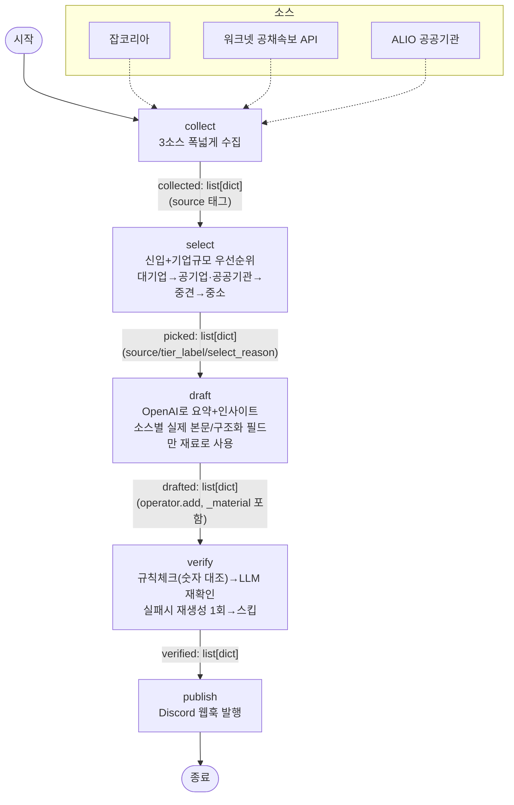

# 나만의 뉴스레터 에이전트 — 인사(HR) 신입 채용 소식

## 1. 분야 및 독자 정의

### 배경

인사(HR) 실무자에게는 "우리 회사가 어떤 조건으로 사람을 뽑는가"만큼 "다른 회사들은 지금 어떻게 뽑고 있는가"가 중요한 정보다. 특히 신입 채용은 대기업·공공기관의 조직 확장/충원 신호를 드러내는 지표라, 경쟁사·업계 동향을 매일 훑어보는 일이 실무에 바로 연결된다. 원래 강의 예시(AI 업계 뉴스)를 그대로 따라가는 대신, 실제로 매일 확인할 이유가 있는 분야로 바꿔 인사·채용 정보를 골랐다.

### 타깃 독자 페르소나 (`audience.yaml`)

| 항목 | 내용 |
|---|---|
| 페르소나 | 대기업·공공기관 인사(HR) 실무자 및 인사 직무 취업준비생 |
| 목적 | 경쟁사·업계의 인사(HR) 부문 신입 채용 동향을 매일 아침 빠르게 파악 |
| 인사이트 관점 | 이 채용 공고가 조직 변화·채용 트렌드·경쟁사 동향 관점에서 어떤 의미가 있는가 (공고 내용 반복 금지) |

이 정의는 문서로만 존재하지 않고 `draft.py`가 `audience.yaml`을 직접 읽어 시스템 프롬프트에 그대로 주입한다 — 페르소나가 바뀌면 요약·인사이트의 관점도 즉시 바뀐다.

---

## 2. 소스 채택표

세 가지 관문(G1 본문·G2 생존·G3 접근)으로 총 11개 후보를 실측했다. 하나라도 막히면 그 아래는 보지 않는 원칙을 따랐다.

| 소스 | G1 본문 | G2 생존 | G3 접근 | 판정 |
|---|---|---|---|---|
| **잡코리아** | 상세페이지 5건 샘플 측정: 673/387/1450/1626/508자 (600자 기준 **3/5 통과, 60%**) | 등록일순 정렬 확인, 매일 새 공고 유입 | robots.txt가 `/recruit/joblist`를 AI 크롤러에 **명시적으로 허용**. 단, 연속 요청 시 응답이 31자로 잘리거나 타임아웃 발생 → 요청 간 1.2~1.5초 지연 추가 후 안정화 | ✅ 채택 |
| **워크넷(work24) 공채속보 API** | 구조화 데이터(회사명/기업구분/채용기간 등 필드형) | 활용신청 **13,391건**, 수정일 2025-07-21로 최근까지 유지보수 | 공식 API, **자동승인**(개발/운영 단계 모두). 단, 개인회원은 "채용정보목록/상세" API는 불가하고 **공채속보·채용행사·공채기업정보만 허용** — 이 제약에 맞춰 공채속보 API로 설계 변경 | ✅ 채택 |
| **ALIO(공공기관 채용정보)** | 상세페이지 실측 259자(모집요강~기업정보, 구조화 필드라 밀도는 높음) | 매일 수십 건씩 신규 등록 확인 | robots.txt **자체가 없음(404)** = 명시적 제한 없음. 완전 서버 렌더링 + CSV 다운로드 버튼까지 존재 | ✅ 채택 |
| 원티드 | 미측정 | 미측정 | robots.txt **요청 자체가 403**(CloudFront WAF 차단) | ❌ 탈락 (접근) |
| 인크루트 (job.incruit.com) | 미측정 | 미측정 | robots.txt에 `User-agent: ClaudeBot`/`GPTBot` → `Disallow: /` **명시** | ❌ 탈락 (접근) |
| 캐치 | 초기 HTML 텍스트 2,275자, 실제 공고는 JS 렌더링 후 표시 | 미측정 | SPA라 정적 요청으로 본문 확보 불가 | ❌ 탈락 (본문) |
| 커리어 (job.career.co.kr) | 필터 UI만 서버 렌더링, 실제 검색결과는 "검색결과가 없습니다" — AJAX 필요 | 미측정 | SPA/AJAX 의존 | ❌ 탈락 (본문) |
| 로켓펀치 | 페이지 전체 텍스트 **34자** | 미측정 | 완전 SPA | ❌ 탈락 (본문) |
| 잡플래닛 | 페이지 전체 텍스트 630자 | 미측정 | SPA | ❌ 탈락 (본문) |
| 비즈니스피플 (bzpp.co.kr) | 미측정 | 미측정 | robots.txt 기본정책 `Disallow: /`, 주석에 "AI 대규모 모델 학습 봇(GPTBot, ClaudeBot 등)은 차단됨"이라 명시. `Claude-SearchBot`은 실시간 사용자 조회용으로만 예외 허용 | ❌ 탈락 (접근) |
| 인디스워크 (inthiswork.com) | 미측정 | 미측정 | robots.txt에 `ClaudeBot`/`GPTBot`/`anthropic-ai` 등 전부 `Disallow: /` | ❌ 탈락 (접근) |

**3개 채택 소스의 역할 분담**: 잡코리아(민간기업 전반) · 워크넷(대기업/공기업 공개채용 속보) · ALIO(공공기관 전용) — 서로 다른 채용 생태계를 보완적으로 커버한다.

---

## 3. 선별 로직 설계

### 중요도 판단 문장

> "인사·노무 직무이면서, 신입 채용이고, 기업 규모가 클수록(대기업 > 공기업·공공기관 > 중견기업 > 중소기업) 먼저 채운다."

이 기준은 전부 각 소스가 이미 제공하는 **검색 파라미터**로 표현 가능하다는 것을 사전에 확인했다 (잡코리아 `career`/`cotype`, 워크넷 `empWantedCareerCd`/`coClcd`, ALIO `career`/NCS `detail_code`). 그래서 "중요도"를 LLM에게 판단시키지 않고, 파라미터 조합만으로 결정되는 **사실 확인**으로 설계했다 — API 키가 선별 단계에는 필요 없는 이유이기도 하다.

### 예선 / 본선 2단계 구조

| 단계 | 함수 | 하는 일 | 결과 |
|---|---|---|---|
| **예선** | `collect()` | 3개 소스에서 "인사 직무" 카테고리로만 넓게 수집 (신입/기업규모 조건 없음) | 116건 (`collected`) |
| **본선** | `select()` | 각 소스에 **신입 + 기업규모 조건을 다시 걸어 재조회**, 대기업→공기업→공공기관→중견기업→중소기업 순서로 목표치가 찰 때까지 소스를 넘나들며 채움 | 5건 (`picked`) |

예선에서 모은 116건을 그대로 필터링하지 않고 본선에서 **재조회**하는 이유: 목록 페이지 자체가 신입/기업규모를 별도 필드로 보여주지 않는 소스가 있어서(잡코리아·ALIO), 사후 필터링이 불가능하고 검색 시점에 조건을 걸어야만 정확하다.

### 묶음(Batch) 크기: 티어당 10건 조회, 최종 5건 확정

- `TARGET_COUNT = 5` — 과제 요건(3~5건)의 상한
- 티어별 조회는 `count=10`으로 목표보다 2배 여유 있게 가져옴 — 중복 제거, 파싱 실패, 특정 티어의 결과 부족(예: 워크넷 "신입+대기업"은 실측 결과 **0건**이었음)에 대비한 버퍼

### 실측으로 확인한 예상 밖의 결과

워크넷 공채속보 API를 인사 직무코드 + 신입 + 기업구분으로 좁혀보니:

| 기업구분 | 신입+기업규모 결과 |
|---|---|
| 대기업 | 0건 |
| 공기업 | 0건 |
| 공공기관 | 0건 |
| 중견기업 | 1건 |

→ 이런 좁은 조합은 실제로 매우 희소하다는 것을 확인했고, 그래서 "한 소스·한 티어에서 채워지지 않으면 다음으로 넘어간다"는 폴백 구조가 장식이 아니라 실제로 매번 작동한다. 최근 실행에서는 잡코리아 대기업 티어 하나에서 5건이 모두 채워졌다.

---

## 4. 파이프라인 구조도



### State 필드와 리듀서

| 필드 | 타입 | 리듀서 | 쓰는 노드 | 이유 |
|---|---|---|---|---|
| `hours` | int | 덮어쓰기 | (설정값) | 한 노드만 읽음 |
| `collected` | list[dict] | 덮어쓰기 | collect | 한 노드가 쓰고 다음이 읽기만 함 |
| `picked` | list[dict] | 덮어쓰기 | select | 위와 동일 |
| `drafted` | list[dict] | `operator.add` | draft | 여러 항목을 순차/병렬로 append하는 자리 |
| `verified` | list[dict] | 덮어쓰기 | verify | drafted가 append 전용이라, "이 중 통과한 것"은 별도 키가 필요 |
| `log` | list[str] | `operator.add` | 모든 노드 | 모든 노드가 한 줄씩 남기는 자리 |

`verified`를 별도 키로 둔 것은 설계상 중요한 결정이다: `drafted`는 `operator.add`라 verify가 "통과한 것만 남긴 더 짧은 리스트"를 반환해도 실제로는 기존 값에 **이어 붙기(대체가 아님)** 때문에, 탈락한 항목이 사라지지 않는 버그가 생긴다. 그래서 verify는 drafted를 그대로 두고 새 키에 결과를 쓴다.

---

## 5. 실행 기록

Discord 웹훅으로 실제 발행된 화면 캡처는 아래에 첨부 예정 (`docs/discord-screenshot.png` 등으로 저장 후 이 자리에 이미지 링크 추가).

아래는 `run.py` 실행의 터미널 로그 전문이다 (2026-09-21, `python run.py`). 이 실행은 `store/metrics.jsonl`에도 한 줄로 기록되어 있다: 총 116건 수집(잡코리아 53·워크넷 13·ALIO 50) → 5건 선별 → 5건 요약 → 5건 검수 통과(통과율 100%) → 5건 발행, 소요 시간 약 41초.

```
[collect] jobkorea 53건 수집
[collect] worknet 13건 수집
[collect] alio 50건 수집
[collect] 총 116건 (3개 소스 합산)
[select] jobkorea/대기업: 5건 추가 (career=1(신입)+cotype=1(대기업))
[select] 116건 중 5건 선택 (신입+기업규모 우선순위)
[draft] ㈜파괴연구소 요약 완료 (재료 673자)
[draft] ㈜퓨처그라프 요약 완료 (재료 487자)
[draft] ㈜한강식품 요약 완료 (재료 573자)
[draft] 현대건설 요약 완료 (재료 1450자)
[draft] 신세계푸드 요약 완료 (재료 1199자)
[draft] 5건 중 5건 요약
[verify] ㈜파괴연구소 통과 (rule)
[verify] ㈜퓨처그라프 통과 (rule)
[verify] ㈜한강식품 통과 (rule)
[verify] 현대건설 통과 (rule->llm)
[verify] 신세계푸드 통과 (rule->llm)
[verify] 5건 중 5건 통과
[publish] 5건 디스코드 발행 완료
```

116건 → 5건 선별 → 5건 요약 → 5건 검수 통과 → 5건 발행까지, 5단계 전체가 실제 데이터로 끝까지 관통했다.

---

## 6. 프로젝트 회고

### 가장 공들인 부분

**"검수 시스템도 검수가 필요하다"는 것을 실제로 겪었다.** verify 노드를 처음 만들었을 때 5건 중 2건이 부당하게 탈락했다. 원인은 검수가 `_material`(본문)만 대조했는데, 잡코리아 본문 추출 범위("모집요강" 이후)는 애초에 회사명·제목을 포함하지 않아서, 요약이 회사명("퓨처그라프")이나 제목 속 연도("2027년")를 정확히 언급했는데도 "재료에 없는 걸 지어냈다"고 오판했기 때문이다. draft가 실제로 모델에게 준 범위(제목+회사+본문)와 verify가 대조하는 범위를 맞추고 나서야 5건 모두 정당하게 통과했다. 검수 로직 자체의 정확성을 의심하고 재현 가능한 실험(같은 입력을 고치기 전/후로 다시 돌려 비교)으로 확인한 과정이 이번 프로젝트에서 가장 공들인 부분이다.

### 향후 보완하고 싶은 점

1. **정성적 할루시네이션 탐지 공백**: 현재 규칙 체크는 숫자만 대조한다. 숫자가 하나도 없는 순수 서술형 지어내기(예: "유니콘 기업으로 급성장 중")는 규칙 체크를 그대로 통과해 LLM 재확인 자체가 트리거되지 않는다는 걸 별도 테스트로 확인했다. 과장성 키워드 목록을 규칙 체크에 추가하거나, 비용을 감수하고 항상 LLM 검수를 도는 방식으로 보완이 필요하다.
2. **`store/metrics.jsonl`은 실행 요약만 기록**: `run.py`가 매 실행마다 총 건수·소스별 기여 건수·verify 통과율·소요 시간을 한 줄씩 남기도록 만들었다. 다만 지금은 "이번 실행이 어땠는지"만 기록할 뿐, 여러 날치를 모아 추세(예: 특정 소스가 최근 계속 0건인지)를 자동으로 감시하는 부분은 아직 없다.
3. **워크넷 소스의 본문 공백**: 워크넷 공채속보가 주는 링크는 회사마다 제각각인 외부 홈페이지라 안정적으로 스크래핑할 수 없어서, 이 소스로 뽑힌 항목은 구조화된 필드(회사명·기업구분·채용기간)만으로 요약한다. 실제 모집요강 본문이 없다는 뜻이라, 다른 두 소스보다 재료가 얇다.
4. **자동 실행 미구현**: 지금은 수동으로 `python run.py`를 실행해야 한다. GitHub Actions로 매일 아침 스케줄링하는 작업이 남아있다.
5. **일일 중복 발행 방지 없음**: 어제 발행한 공고가 오늘 또 뽑힐 수 있다. 발행된 공고 ID를 기록해두고 "새로 올라온 것"만 거르는 로직이 없다.
